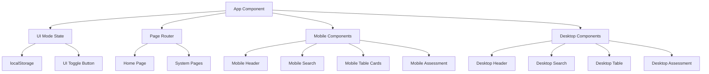

# Design Document

## Overview

本设计文档详细描述了为英语分级体系查询平台添加手机版切换功能和重构手机端UI/UX的技术实现方案。设计采用响应式设计原则，通过状态管理实现桌面版和手机版的无缝切换，并针对移动设备优化交互体验。

## Architecture

### 系统架构图



### 状态管理架构

- **UI Mode State**: 管理当前显示模式（desktop/mobile）
- **Persistent Storage**: 使用localStorage保存用户偏好
- **Conditional Rendering**: 基于模式状态渲染不同组件
- **Shared Logic**: 业务逻辑在两种模式间共享

## Components and Interfaces

### 1. UI Mode Toggle Component

```typescript
interface UIModeToggleProps {
  currentMode: 'desktop' | 'mobile';
  onModeChange: (mode: 'desktop' | 'mobile') => void;
}

interface UIModeToggleState {
  isAnimating: boolean;
}
```

**功能特性:**
- 位于页面右上角的切换按钮
- 图标动画切换（桌面/手机图标）
- 支持键盘导航（Tab + Enter）
- 切换时的平滑过渡动画

### 2. Mobile Header Component

```typescript
interface MobileHeaderProps {
  currentPage: string;
  onPageChange: (page: string) => void;
  onModeToggle: () => void;
}

interface MobileHeaderState {
  isMenuOpen: boolean;
  isScrolled: boolean;
}
```

**设计特点:**
- 固定顶部，高度48px
- 左侧：应用图标 + 标题（截断显示）
- 右侧：版本切换按钮 + 汉堡菜单
- 滚动时添加阴影效果

### 3. Mobile Navigation Menu

```typescript
interface MobileNavMenuProps {
  isOpen: boolean;
  currentPage: string;
  onClose: () => void;
  onNavigate: (page: string) => void;
}
```

**交互设计:**
- 全屏覆盖层（z-index: 1000）
- 从右侧滑入动画（300ms ease-out）
- 背景模糊效果
- 支持滑动手势关闭

### 4. Mobile Search Interface

```typescript
interface MobileSearchProps {
  lexileInput: string;
  gradeInput: string;
  onLexileSearch: () => void;
  onGradeSearch: () => void;
  onAssessmentOpen: () => void;
  searchResult: GradingLevel | null;
}
```

**布局设计:**
- 垂直堆叠布局
- 输入框最小高度48px
- 按钮最小触摸目标44x44px
- 结果卡片使用2列网格（小屏）

### 5. Mobile Comparison Cards

```typescript
interface MobileComparisonCardsProps {
  levels: GradingLevel[];
  filterCEFR: string;
  onFilterChange: (cefr: string) => void;
}

interface LevelCardProps {
  level: GradingLevel;
  isHighlighted?: boolean;
}
```

**卡片设计:**
- 每个级别一张卡片
- 圆角16px，阴影效果
- 主要信息突出显示
- 支持展开/收起详细信息

### 6. Mobile Assessment Modal

```typescript
interface MobileAssessmentProps {
  isOpen: boolean;
  onClose: () => void;
  onComplete: (lexile: number) => void;
}

interface MobileQuestionProps {
  question: Question;
  onAnswer: (score: number) => void;
  questionNumber: number;
  totalQuestions: number;
}
```

**移动端优化:**
- 全屏显示（100vh）
- 大号字体（18px+）
- 选项按钮最小高度56px
- 进度条在顶部固定显示

## Data Models

### UI Mode State

```typescript
interface UIModeState {
  currentMode: 'desktop' | 'mobile';
  userPreference: 'desktop' | 'mobile' | 'auto';
  deviceType: 'desktop' | 'tablet' | 'mobile';
  screenWidth: number;
}
```

### Mobile Layout Configuration

```typescript
interface MobileLayoutConfig {
  headerHeight: number; // 48px
  minTouchTarget: number; // 44px
  cardSpacing: number; // 16px
  containerPadding: number; // 16px
  borderRadius: {
    small: number; // 8px
    medium: number; // 16px
    large: number; // 24px
  };
  breakpoints: {
    mobile: number; // 768px
    tablet: number; // 1024px
  };
}
```

### Animation Configuration

```typescript
interface AnimationConfig {
  duration: {
    fast: number; // 150ms
    normal: number; // 300ms
    slow: number; // 500ms
  };
  easing: {
    easeOut: string; // 'cubic-bezier(0.25, 0.46, 0.45, 0.94)'
    easeInOut: string; // 'cubic-bezier(0.645, 0.045, 0.355, 1)'
  };
}
```

## Correctness Properties

*A property is a characteristic or behavior that should hold true across all valid executions of a system-essentially, a formal statement about what the system should do. Properties serve as the bridge between human-readable specifications and machine-verifiable correctness guarantees.*

### Property-Based Testing Overview

Property-based testing (PBT) validates software correctness by testing universal properties across many generated inputs. Each property is a formal specification that should hold for all valid inputs.

### Core Principles

1. **Universal Quantification**: Every property must contain an explicit "for all" statement
2. **Requirements Traceability**: Each property must reference the requirements it validates
3. **Executable Specifications**: Properties must be implementable as automated tests
4. **Comprehensive Coverage**: Properties should cover all testable acceptance criteria

### Converting EARS to Properties

基于prework分析，我确定了以下可测试的正确性属性：

**Property 1: UI Mode Toggle Functionality**
*For any* initial UI mode state, clicking the toggle button should switch to the opposite mode and update the interface accordingly
**Validates: Requirements 1.2**

**Property 2: UI Mode Persistence**
*For any* UI mode selection (desktop/mobile), the system should save the choice to localStorage and restore it on page refresh
**Validates: Requirements 1.3, 1.4**

**Property 3: State Preservation During Mode Switch**
*For any* user input data (search terms, form values), switching between desktop and mobile modes should preserve all current state
**Validates: Requirements 1.5**

**Property 4: Mobile Navigation Menu Behavior**
*For any* mobile navigation interaction, clicking the hamburger menu should open the full-screen menu, and selecting any menu item should close the menu and navigate correctly
**Validates: Requirements 2.3, 2.5**

**Property 5: Touch Target Accessibility**
*For any* interactive element in mobile mode, the touch target should be at least 44x44 pixels to ensure accessibility
**Validates: Requirements 7.1**

**Property 6: Mobile Input Validation**
*For any* user input in mobile query forms, the system should provide real-time validation and appropriate feedback
**Validates: Requirements 3.3**

**Property 7: Mobile Card Data Completeness**
*For any* grading level data, when displayed as mobile cards, all essential information (oxford level, lexile range, CEFR, etc.) should be visible and complete
**Validates: Requirements 4.2**

**Property 8: Mobile Touch Gesture Support**
*For any* mobile interface element, the system should respond correctly to swipe, tap, and long-press gestures
**Validates: Requirements 7.2, 7.3**

**Property 9: Book Card Interaction**
*For any* book recommendation, clicking the card should display detailed information, and the close action should return to the list state
**Validates: Requirements 5.3, 5.5**

**Property 10: Assessment Flow Completion**
*For any* completed assessment in mobile mode, the system should display results and automatically populate the search form with the calculated lexile value
**Validates: Requirements 6.5**

**Property 11: Mobile Performance Response Time**
*For any* user interaction in mobile mode, the system should respond within 100ms to provide immediate feedback
**Validates: Requirements 8.3**

**Property 12: Mobile Page Load Performance**
*For any* mobile page load, the system should complete first screen rendering within 3 seconds
**Validates: Requirements 8.1**

**Property 13: Error Handling and Recovery**
*For any* error condition in mobile mode, the system should display user-friendly error messages and provide retry options
**Validates: Requirements 7.5, 8.5**

## Error Handling

### UI Mode Switch Errors

```typescript
interface UIModeError {
  type: 'STORAGE_ERROR' | 'RENDER_ERROR' | 'ANIMATION_ERROR';
  message: string;
  fallback: 'desktop' | 'mobile';
}
```

**错误处理策略:**
- localStorage失败时回退到默认桌面模式
- 渲染错误时显示简化版界面
- 动画失败时跳过动画直接切换

### Mobile Layout Errors

```typescript
interface LayoutError {
  type: 'OVERFLOW_ERROR' | 'TOUCH_TARGET_ERROR' | 'VIEWPORT_ERROR';
  element: string;
  expectedSize: number;
  actualSize: number;
}
```

**处理机制:**
- 内容溢出时自动启用滚动
- 触摸目标过小时动态调整尺寸
- 视口问题时使用安全区域适配

### Network and Performance Errors

```typescript
interface PerformanceError {
  type: 'SLOW_RESPONSE' | 'MEMORY_LIMIT' | 'RENDER_TIMEOUT';
  threshold: number;
  actual: number;
  action: 'RETRY' | 'FALLBACK' | 'NOTIFY';
}
```

**优化策略:**
- 响应时间超过阈值时显示加载指示器
- 内存使用过高时清理不必要的DOM元素
- 渲染超时时回退到简化版本

## Testing Strategy

### Dual Testing Approach

本项目采用单元测试和属性测试相结合的策略：

**Unit Tests:**
- 测试特定的UI组件渲染
- 验证事件处理函数的正确性
- 检查边界条件和错误状态
- 测试localStorage操作

**Property-Based Tests:**
- 使用fast-check库进行属性测试
- 每个测试运行最少100次迭代
- 生成随机的屏幕尺寸、用户输入和状态组合
- 验证系统在各种条件下的一致性

### Testing Configuration

**Property Test Setup:**
```typescript
// 使用fast-check进行属性测试
import fc from 'fast-check';

// 测试配置
const testConfig = {
  numRuns: 100, // 最少100次迭代
  timeout: 5000, // 5秒超时
  seed: 42 // 可重现的随机种子
};
```

**Test Tags:**
每个属性测试必须包含以下标签格式：
```typescript
// Feature: mobile-ui-enhancement, Property 1: UI Mode Persistence
```

### Integration Testing

**端到端测试场景:**
- 完整的模式切换流程
- 移动端导航和搜索流程
- 自测功能的完整用户旅程
- 不同屏幕尺寸下的响应式行为

**性能测试:**
- 首屏渲染时间测量
- 交互响应时间验证
- 内存使用情况监控
- 网络请求优化验证